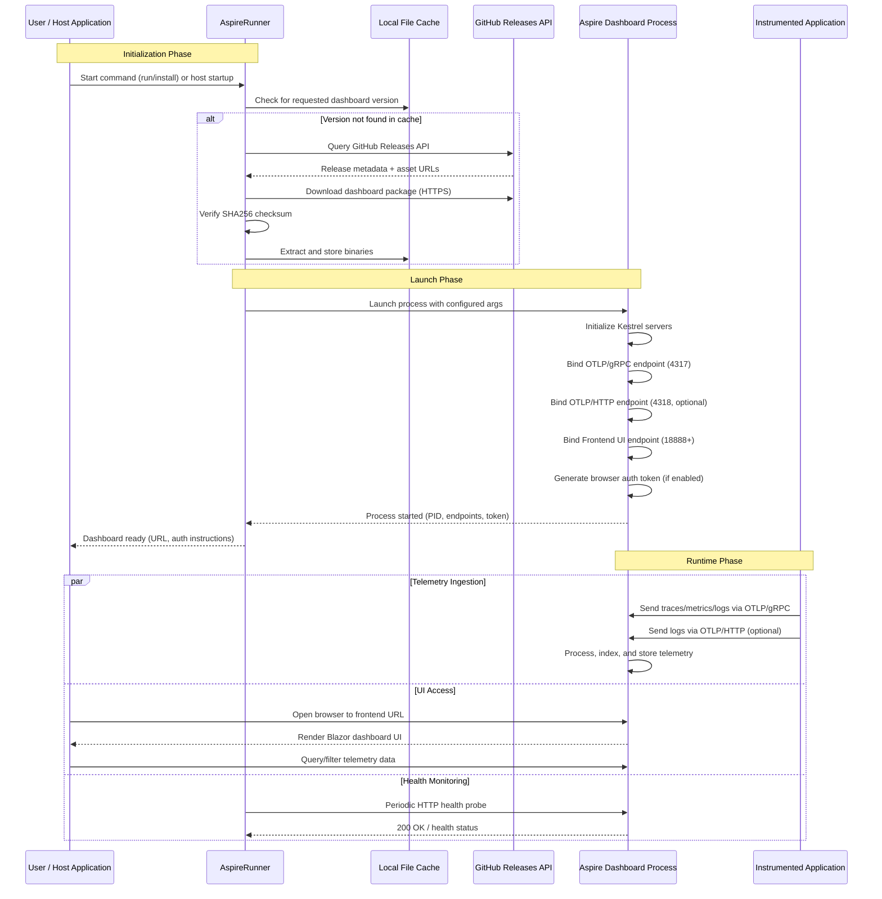
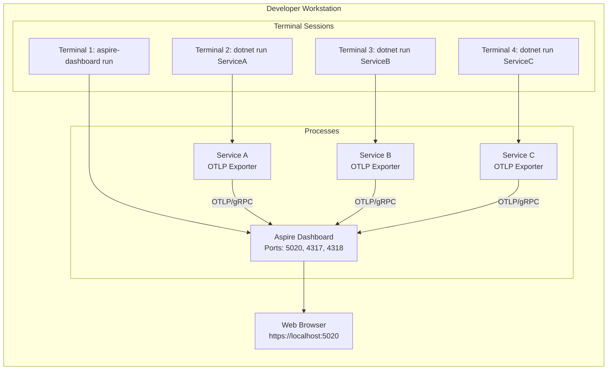
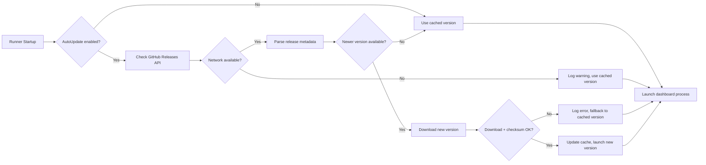

# AspireRunner - Architecture Documentation

> **Repository**: https://github.com/SaifAqqad/AspireRunner  
> **License**: Unlicense  
> **Platform**: .NET 8.0+  
> **Document Version**: 1.0.0  
> **Last Updated**: April 2026  

---

## 📋 Table of Contents

1. [Overview](#overview)
2. [System Architecture](#system-architecture)
3. [Component Architecture](#component-architecture)
4. [Data Flow](#data-flow)
5. [Configuration Management](#configuration-management)
6. [Deployment Models](#deployment-models)
7. [Dependencies & Technologies](#dependencies--technologies)
8. [Integration Patterns](#integration-patterns)
9. [Security Considerations](#security-considerations)
10. [Extensibility](#extensibility)
11. [Monitoring & Observability](#monitoring--observability)
12. [Versioning & Updates](#versioning--updates)
13. [Troubleshooting Guide](#troubleshooting-guide)
14. [Future Architecture Considerations](#future-architecture-considerations)

---

## 🔍 Overview

**AspireRunner** is a standalone orchestration tool for the .NET Aspire Dashboard that enables visualization of OpenTelemetry data (traces, metrics, and logs) from any application. It abstracts the complexity of dashboard lifecycle management, providing two primary consumption models:

| Component | Purpose | Target Audience |
|-----------|---------|----------------|
| `AspireRunner.Tool` | CLI-based global .NET tool for running the dashboard | Developers, DevOps engineers |
| `AspireRunner.AspNetCore` | Hosted library for embedding dashboard in ASP.NET Core apps | Application developers |

### Key Capabilities

- ✅ Automatic download & version management of Aspire Dashboard
- ✅ Process lifecycle management (start, stop, restart, monitoring)
- ✅ OpenTelemetry Protocol (OTLP) endpoint configuration
- ✅ Browser token authentication support
- ✅ Multi-instance handling strategies
- ✅ HTTPS/TLS configuration for all endpoints
- ✅ Cross-platform support (Windows, Linux, macOS)

### Core Value Proposition

```
┌─────────────────────────────────────────────────────┐
│  AspireRunner = Dashboard Lifecycle + Configuration │
│                                                     │
│  • No manual Aspire.Dashboard installation          │
│  • No complex process orchestration code            │
│  • Consistent configuration across environments     │
│  • Developer-friendly CLI & hosted service APIs     │
└─────────────────────────────────────────────────────┘
```

---

## 🏗️ System Architecture

### High-Level Component Diagram

```mermaid
graph TB
    subgraph "External Systems"
        App[Instrumented Application<br/>(OTLP Exporter)]
        OTLPServer[External OTLP Collector]
        Browser[Web Browser]
        GitHub[GitHub Releases API]
    end

    subgraph "AspireRunner Ecosystem"
        direction TB
        
        subgraph "AspireRunner.Tool"
            CLI[CLI Entry Point<br/>Program.cs]
            CmdParser[Spectre.Console.Cli<br/>Command Parser]
            DashboardMgr[Dashboard Manager<br/>DashboardRunner.cs]
        end

        subgraph "AspireRunner.AspNetCore"
            HostMiddleware[ASP.NET Core Middleware]
            HostedService[DashboardHostedService<br/>IHostedService]
            ConfigBinder[Options Binder<br/>IOptions<T>]
        end

        subgraph "AspireRunner.Core"
            ProcessLauncher[Process Launcher<br/>Cross-platform]
            VersionResolver[Version Resolver<br/>NuGet-style semver]
            FileDownloader[Dashboard Downloader<br/>HTTPS + checksum]
            HealthMonitor[Health Monitor<br/>HTTP probing]
            Logger[Structured Logger<br/>Microsoft.Extensions.Logging]
        end

        subgraph "Aspire Dashboard<br/>(Downloaded Artifact)"
            DashboardUI[Dashboard Web UI<br/>Blazor Server]
            OTLPGrpc[OTLP/gRPC Server<br/>Port 4317]
            OTLPHttp[OTLP/HTTP Server<br/>Port 4318]
            MCPServer[Model Context Protocol<br/>Optional]
        end
    end

    App -->|OTLP Telemetry| OTLPGrpc
    App -->|OTLP Telemetry| OTLPHttp
    CLI --> CmdParser
    CmdParser --> DashboardMgr
    HostMiddleware --> ConfigBinder
    ConfigBinder --> HostedService
    DashboardMgr --> ProcessLauncher
    HostedService --> ProcessLauncher
    ProcessLauncher --> FileDownloader
    FileDownloader -->|if missing| GitHub
    ProcessLauncher --> DashboardUI
    DashboardUI --> Browser
    HealthMonitor --> DashboardUI
    ProcessLauncher --> Logger
```

### Architecture Principles

| Principle | Implementation |
|-----------|---------------|
| **Separation of Concerns** | Core logic isolated in `AspireRunner.Core`; consumption models in separate projects |
| **Configuration Over Code** | All behavior configurable via options, environment variables, or CLI args |
| **Defensive Process Management** | Health monitoring, restart policies, and graceful shutdown handling |
| **Secure by Default** | HTTPS enforcement, token auth options, checksum validation for downloads |
| **Extensibility First** | Virtual methods, interfaces, and callback hooks for customization |

---

## 🧩 Component Architecture

### 1. AspireRunner.Tool (CLI Tool)

```
AspireRunner.Tool/
├── Program.cs                      # Entry point with Spectre.Console.Cli registration
├── Commands/
│   ├── RunCommand.cs               # Primary command: start dashboard with options
│   ├── InstallCommand.cs           # Download specific dashboard version manually
│   ├── UninstallCommand.cs         # Remove specific or all dashboard versions
│   └── CleanupCommand.cs           # Remove old versions and temporary files
├── Services/
│   ├── DashboardRunner.cs          # Orchestrates dashboard process lifecycle
│   └── VersionManager.cs           # Handles version resolution & update checks
├── Options/
│   ├── RunOptions.cs               # CLI argument binding for run command
│   ├── GlobalOptions.cs            # Shared configuration (verbose, config path)
│   └── InstallOptions.cs           # Options for install/uninstall commands
└── Properties/
    └── launchSettings.json         # Development launch profiles
```

#### Key Responsibilities

- Parse CLI arguments using `Spectre.Console.Cli` with rich terminal UI
- Resolve dashboard version (explicit version, `latest`, or auto-update policy)
- Download dashboard binaries to configurable cache directory (`~/.dotnet/.AspireRunner/` by default)
- Launch dashboard as child process with configured environment variables and arguments
- Handle process exit codes, restart logic, and user interruption (Ctrl+C)
- Provide helpful error messages and diagnostic output in verbose mode

#### CLI Command Reference

```bash
# Install the tool globally
dotnet tool install -g AspireRunner.Tool

# Run dashboard with defaults
aspire-dashboard run

# Run with custom configuration
aspire-dashboard run \
  --frontend-port 5000 \
  --otlp-port 4318 \
  --otlp-http-port 4319 \
  --auth \
  --browser-token "my-secret-token" \
  --https \
  --launch-browser \
  --verbose

# Install specific dashboard version
aspire-dashboard install --version 8.2.0

# List installed versions
aspire-dashboard install --list

# Cleanup old versions
aspire-dashboard cleanup --keep-last 3
```

### 2. AspireRunner.AspNetCore (Hosted Library)

```
AspireRunner.AspNetCore/
├── ServiceCollectionExtensions.cs  # AddAspireDashboard() extension method
├── AspireDashboardOptions.cs       # Configuration POCO with validation
├── DashboardHostedService.cs       # IHostedService implementation for lifecycle
├── Middleware/
│   └── DashboardProxyMiddleware.cs # Optional request proxying for embedded scenarios
├── Enums/
│   ├── SingleInstanceHandling.cs   # Instance conflict resolution strategy
│   └── DashboardMode.cs            # Embed vs Standalone operational modes
├── Validators/
│   └── AspireDashboardOptionsValidator.cs # FluentValidation rules
└── Properties/
    └── AssemblyInfo.cs             # Package metadata attributes
```

#### Key Responsibilities

- Integrate seamlessly with ASP.NET Core dependency injection and configuration system
- Bind options from `appsettings.json`, environment variables, command line, or code-first configuration
- Start dashboard as background hosted service during application startup
- Support graceful shutdown synchronization with host application lifetime
- Provide developer-friendly configuration experience with IntelliSense and validation
- Optionally proxy dashboard requests through host application for unified routing

#### Usage Example

```csharp
// Program.cs - Minimal hosting model
var builder = WebApplication.CreateBuilder(args);

// Configure dashboard options
builder.Services.AddAspireDashboard(options =>
{
    // Frontend UI configuration
    options.Frontend.EndpointUrls = "https://localhost:5020";
    options.Frontend.AuthMode = AuthMode.BrowserToken;
    
    // OTLP ingestion endpoints
    options.Otlp.EndpointUrl = "https://localhost:4317";
    options.Otlp.HttpEndpointUrl = "https://localhost:4318";
    
    // Runner lifecycle options
    options.Runner.LaunchBrowser = builder.Environment.IsDevelopment();
    options.Runner.Mode = DashboardMode.Embed;
    options.Runner.AutoUpdate = true;
    options.Runner.PreferredVersion = "latest";
});

var app = builder.Build();

// Optional: Map dashboard proxy endpoint for embedded access
if (builder.Environment.IsDevelopment())
{
    app.MapWhen(
        ctx => ctx.Request.Path.StartsWithSegments("/dashboard"),
        appBuilder => appBuilder.UseDashboardProxy());
}

app.MapGet("/", () => "Hello World!");
await app.RunAsync(); // Dashboard starts/stops with application
```

### 3. AspireRunner.Core (Shared Library)

```
AspireRunner.Core/
├── DashboardProcess/
│   ├── ProcessLauncher.cs          # Cross-platform process creation & management
│   ├── ProcessMonitor.cs           # Health checks, restart logic, exit handling
│   ├── OutputPiper.cs              # Stream dashboard stdout/stderr to host logger
│   └── ProcessConfig.cs            # Immutable configuration for process launch
├── Download/
│   ├── DashboardDownloader.cs      # HTTP download with progress, retries, checksum
│   ├── VersionResolver.cs          # NuGet-style semver resolution & comparison
│   ├── FileSystemCache.cs          # Local caching with LRU eviction policy
│   └── DownloadResult.cs           # Result type with success/failure semantics
├── Configuration/
│   ├── AspireDashboardOptions.cs   # Shared options model for all consumption models
│   ├── EndpointBuilder.cs          # URL construction with protocol/port validation
│   ├── EnvironmentVariableBinder.cs # Type-safe env var to options mapping
│   └── OptionValidators.cs         # FluentValidation rules for configuration
├── Utilities/
│   ├── LoggerAdapter.cs            # Microsoft.Extensions.Logging abstraction layer
│   ├── PlatformHelper.cs           # OS-specific path, process, and signal handling
│   ├── RetryPolicy.cs              # Exponential backoff retry utility
│   └── CancellationTokenExtensions.cs # Cooperative cancellation helpers
├── Interfaces/
│   ├── IDashboardProcess.cs        # Abstraction for dashboard process control
│   ├── IVersionResolver.cs         # Extensibility point for custom version sources
│   └── IDashboardDownloader.cs     # Abstraction for custom download strategies
└── Exceptions/
    ├── DashboardLaunchException.cs # Process failed to start
    ├── DownloadException.cs        # Dashboard download/verification failed
    └── ConfigurationException.cs   # Invalid or conflicting configuration
```

#### Key Responsibilities

- Abstract process management across Windows/Linux/macOS with platform-specific implementations
- Handle secure downloading and SHA256 checksum verification of dashboard binaries
- Provide unified, validated configuration model consumable by both CLI and hosted service
- Implement resilient retry logic, timeout handling, and graceful error recovery
- Expose extensibility interfaces for advanced customization scenarios

---

## 🔄 Data Flow

### Dashboard Startup Sequence



### Configuration Precedence (Highest to Lowest)

```
1️⃣ CLI Arguments / Code Configuration
   └─ Direct method calls or command-line flags override all else

2️⃣ Environment Variables
   └─ ASPIRE_DASHBOARD_*, DOTNET_*, OTEL_* prefixed variables

3️⃣ Configuration Files
   └─ appsettings.json → appsettings.{Environment}.json → user secrets

4️⃣ Default Values
   └─ Defined in AspireDashboardOptions class properties
```

### Environment Variable Reference

| Variable | Description | Default | Example |
|----------|-------------|---------|---------|
| `ASPIRE_RUNNER_PATH` | Custom download directory for dashboard binaries | `~/.dotnet/.AspireRunner` | `/opt/aspire-cache` |
| `ASPIRE_DASHBOARD_FRONTEND_ENDPOINTURLS` | Dashboard UI bind address (semicolon-separated for multiple) | `https://localhost:18888` | `https://+:5020` |
| `ASPIRE_DASHBOARD_OTLP_ENDPOINTURL` | OTLP/gRPC endpoint for trace/metric ingestion | `https://localhost:4317` | `http://0.0.0.0:4317` |
| `ASPIRE_DASHBOARD_OTLP_HTTP_ENDPOINTURL` | OTLP/HTTP endpoint (optional, disabled by default) | *disabled* | `https://localhost:4318` |
| `ASPIRE_DASHBOARD_AUTH_BROWSER_TOKEN` | Enable browser token authentication | `false` | `true` |
| `ASPIRE_DASHBOARD_AUTH_BROWSER_TOKEN_VALUE` | Predefined browser auth token value | *auto-generated* | `my-secure-token-123` |
| `DOTNET_HTTPS_REDIRECTION_ENABLED` | Force HTTPS redirection for frontend | `true` | `false` |
| `OTEL_SERVICE_NAME` | Default service name for unattributed telemetry | *application-derived* | `my-microservice` |

---

## ⚙️ Configuration Management

### AspireDashboardOptions Schema (C#)

```csharp
using System.ComponentModel.DataAnnotations;

public class AspireDashboardOptions
{
    /// <summary>
    /// Configuration for the dashboard frontend UI
    /// </summary>
    [ValidateNotNull]
    public FrontendOptions Frontend { get; set; } = new();
    
    /// <summary>
    /// Configuration for OTLP telemetry ingestion endpoints
    /// </summary>
    [ValidateNotNull]
    public OtlpOptions Otlp { get; set; } = new();
    
    /// <summary>
    /// Configuration for Model Context Protocol server (optional)
    /// </summary>
    public McpOptions? Mcp { get; set; }
    
    /// <summary>
    /// Runner-specific lifecycle and operational options
    /// </summary>
    [ValidateNotNull]
    public RunnerOptions Runner { get; set; } = new();
}

public class FrontendOptions
{
    [Required, RegularExpression(@"^https?://.+", ErrorMessage = "Must be valid HTTP/HTTPS URL")]
    public string EndpointUrls { get; set; } = "https://localhost:18888";
    
    public AuthMode AuthMode { get; set; } = AuthMode.None;
    
    [MinLength(16, ErrorMessage = "Browser token must be at least 16 characters")]
    public string? BrowserToken { get; set; }
    
    public bool EnableHttpsRedirection { get; set; } = true;
}

public class OtlpOptions
{
    [Required]
    public string EndpointUrl { get; set; } = "https://localhost:4317";
    
    public string? HttpEndpointUrl { get; set; } // Optional HTTP endpoint
    
    [MinLength(32, ErrorMessage = "API key must be at least 32 characters")]
    public string? ApiKey { get; set; } // For OTLP authentication
    
    public int MaxPayloadSizeMb { get; set; } = 10;
}

public class RunnerOptions
{
    /// <summary>
    /// Pipe dashboard stdout/stderr to host logger
    /// </summary>
    public bool PipeOutput { get; set; } = false;
    
    /// <summary>
    /// Automatically open browser when dashboard starts (development only)
    /// </summary>
    public bool LaunchBrowser { get; set; } = false;
    
    /// <summary>
    /// Strategy when dashboard instance already exists on configured ports
    /// </summary>
    public SingleInstanceHandling SingleInstanceHandling { get; set; } 
        = SingleInstanceHandling.WarnAndExit;
    
    /// <summary>
    /// Automatically check for and download newer dashboard versions
    /// </summary>
    public bool AutoUpdate { get; set; } = true;
    
    /// <summary>
    /// Preferred dashboard version: explicit semver, "latest", or null for cached
    /// </summary>
    public string? PreferredVersion { get; set; }
    
    /// <summary>
    /// Attempt to restart dashboard if it exits unexpectedly
    /// </summary>
    public bool RestartOnFailure { get; set; } = false;
    
    [Range(0, 10)]
    public int RunRetryCount { get; set; } = 3;
    
    [Range(1, 60)]
    public int RunRetryDelay { get; set; } = 5; // seconds
    
    /// <summary>
    /// Operational mode: Embed (tied to host) or Standalone (independent)
    /// </summary>
    public DashboardMode Mode { get; set; } = DashboardMode.Embed;
    
    /// <summary>
    /// Callback invoked after dashboard successfully starts
    /// </summary>
    public Func<DashboardEndpointInfo, CancellationToken, Task>? OnDashboardStarted { get; set; }
}

public enum AuthMode { None, BrowserToken, ApiKey, Both }
public enum SingleInstanceHandling { WarnAndExit, ReplaceExisting, AttachToExisting }
public enum DashboardMode { Embed, Standalone }
```

### Configuration Binding Examples

#### appsettings.json
```json
{
  "AspireDashboard": {
    "Frontend": {
      "EndpointUrls": "https://localhost:5020",
      "AuthMode": "BrowserToken",
      "BrowserToken": "${DASHBOARD_TOKEN}"
    },
    "Otlp": {
      "EndpointUrl": "https://localhost:4317",
      "HttpEndpointUrl": "https://localhost:4318",
      "ApiKey": "${OTLP_API_KEY}"
    },
    "Runner": {
      "PipeOutput": true,
      "LaunchBrowser": true,
      "AutoUpdate": false,
      "PreferredVersion": "8.2.0",
      "RestartOnFailure": true,
      "Mode": "Embed"
    }
  }
}
```

#### Environment Variables (.env)
```bash
# Runner configuration
ASPIRE_RUNNER_PATH=/opt/aspire-cache

# Frontend configuration
ASPIRE_DASHBOARD_FRONTEND_ENDPOINTURLS=https://0.0.0.0:5020
ASPIRE_DASHBOARD_AUTH_BROWSER_TOKEN=true
ASPIRE_DASHBOARD_AUTH_BROWSER_TOKEN_VALUE=prod-token-xyz789

# OTLP configuration
ASPIRE_DASHBOARD_OTLP_ENDPOINTURL=https://0.0.0.0:4317
ASPIRE_DASHBOARD_OTLP_HTTP_ENDPOINTURL=https://0.0.0.0:4318
ASPIRE_DASHBOARD_OTLP_APIKEY=${OTLP_API_KEY}

# Telemetry export (for instrumented apps)
OTEL_EXPORTER_OTLP_ENDPOINT=https://localhost:4317
OTEL_SERVICE_NAME=my-aspire-app
```

---

## 🚀 Deployment Models

### Model 1: Global .NET Tool (Development & CI/CD)

```bash
# One-time installation per machine/runner
dotnet tool install -g AspireRunner.Tool --version 1.0.0

# Basic usage - start dashboard with defaults
aspire-dashboard run

# Advanced usage - production-like configuration
aspire-dashboard run \
  --frontend-port 5000 \
  --otlp-port 4317 \
  --otlp-http-port 4318 \
  --auth browser-token \
  --browser-token "${DASHBOARD_TOKEN}" \
  --https \
  --no-launch-browser \
  --verbose

# Version management
aspire-dashboard install --version 8.2.0          # Download specific version
aspire-dashboard install --list                   # List cached versions
aspire-dashboard uninstall --version 8.1.0        # Remove old version
aspire-dashboard cleanup --keep-last 2            # Retain only last N versions
```

**Use Cases**:
- ✅ Local development with multiple microservices
- ✅ CI/CD pipeline telemetry collection
- ✅ Ephemeral testing environments
- ✅ Developer onboarding scripts

**Pros**: Simple installation, isolated from application code, easy version management  
**Cons**: Requires separate process management, not suitable for production hosting

### Model 2: Embedded in ASP.NET Core Application

```csharp
// Program.cs - .NET 8 minimal hosting
var builder = WebApplication.CreateBuilder(args);

// Add your application services
builder.Services.AddMyBusinessLogic();
builder.Services.AddOpenTelemetry().WithTracing(...);

// Embed Aspire Dashboard in development environments
if (builder.Environment.IsDevelopment())
{
    builder.Services.AddAspireDashboard(options =>
    {
        options.Frontend.EndpointUrls = "https://localhost:5020";
        options.Otlp.EndpointUrl = "https://localhost:4317";
        options.Runner.LaunchBrowser = true;
        options.Runner.Mode = DashboardMode.Embed;
        options.Runner.OnDashboardStarted = async (info, token) =>
        {
            builder.Logger.LogInformation("Dashboard available at {Url}", info.FrontendUrl);
        };
    });
}

var app = builder.Build();

// Optional: Proxy dashboard requests through application for unified access
if (builder.Environment.IsDevelopment())
{
    app.MapWhen(
        ctx => ctx.Request.Path.StartsWithSegments("/observability"),
        appBuilder => appBuilder.UseDashboardProxy("/observability"));
}

app.MapGet("/", () => "Application with embedded observability");
await app.RunAsync(); // Dashboard lifecycle tied to application
```

**Use Cases**:
- ✅ Self-contained development environments
- ✅ Demo applications with built-in observability
- ✅ Integrated debugging sessions
- ✅ Educational/tutorial projects

**Pros**: Single deployment artifact, simplified configuration, automatic lifecycle management  
**Cons**: Increases application footprint, not suitable for production telemetry aggregation

### Model 3: Standalone Process (Production-like / Shared Infrastructure)

```csharp
// Configure for detached, production-ready deployment
builder.Services.AddAspireDashboard(options =>
{
    // Fixed, pinned version for stability
    options.Runner.Mode = DashboardMode.Standalone;
    options.Runner.AutoUpdate = false;
    options.Runner.PreferredVersion = "8.2.0";
    
    // Handle instance conflicts gracefully
    options.Runner.SingleInstanceHandling = SingleInstanceHandling.ReplaceExisting;
    
    // Production security settings
    options.Frontend.AuthMode = AuthMode.BrowserToken;
    options.Frontend.BrowserToken = Environment.GetEnvironmentVariable("DASHBOARD_TOKEN");
    options.Otlp.ApiKey = Environment.GetEnvironmentVariable("OTLP_API_KEY");
    
    // Network binding for container/reverse proxy scenarios
    options.Frontend.EndpointUrls = "https://0.0.0.0:5020";
    options.Otlp.EndpointUrl = "https://0.0.0.0:4317";
    
    // Disable browser launch in headless environments
    options.Runner.LaunchBrowser = false;
    options.Runner.PipeOutput = true; // Log to host for monitoring
});
```

**Use Cases**:
- ✅ Shared dashboard instance for multiple development services
- ✅ Containerized deployments (Docker/Kubernetes)
- ✅ Multi-application telemetry aggregation
- ✅ Staging/pre-production environments

**Pros**: Centralized observability, resource efficiency, consistent configuration  
**Cons**: Requires network configuration, authentication management, monitoring setup

---

## 📦 Dependencies & Technologies

### Core NuGet Dependencies

| Package | Purpose | Version Constraint | License |
|---------|---------|-------------------|---------|
| `Microsoft.Extensions.Hosting` | Hosting abstractions, lifetime management | >= 8.0.0 | MIT |
| `Microsoft.Extensions.Logging` | Structured logging abstraction | >= 8.0.0 | MIT |
| `Microsoft.Extensions.Options.ConfigurationExtensions` | Options binding from configuration | >= 8.0.0 | MIT |
| `Microsoft.Extensions.DependencyInjection` | Dependency injection container | >= 8.0.0 | MIT |
| `Spectre.Console` | Rich terminal UI for CLI tool | 0.55.0 | MIT |
| `Spectre.Console.Cli` | CLI argument parsing with help generation | 0.55.0 | MIT |
| `FluentValidation` | Configuration validation (optional) | >= 11.0.0 | Apache-2.0 |

### Runtime Requirements

| Component | Requirement | Notes |
|-----------|-------------|-------|
| **.NET Runtime (Runner)** | .NET 8.0 SDK or Runtime | Required to execute AspireRunner |
| **.NET Runtime (Dashboard)** | .NET 8.0 Runtime | Downloaded automatically; not bundled |
| **Operating System** | Windows 10+, Linux (glibc 2.31+), macOS 12+ | Cross-platform process management |
| **Network Access** | Outbound HTTPS to `api.github.com` | For dashboard version checks and downloads |
| **Disk Space** | ~150 MB per dashboard version | Cached in `ASPIRE_RUNNER_PATH` |
| **Ports** | Configurable frontend + OTLP endpoints | Default: 18888, 4317, 4318 |

### Optional Integrations

| Integration | Purpose | Configuration |
|-------------|---------|---------------|
| **OpenTelemetry SDK** | Export traces/metrics/logs to dashboard | `OTEL_EXPORTER_OTLP_ENDPOINT` env var |
| **ASP.NET Core Kestrel** | Host embedded dashboard within application | Automatic via `AddAspireDashboard()` |
| **YARP / nginx / Caddy** | Reverse proxy for production exposure | Configure upstream to dashboard endpoints |
| **Docker / Podman** | Containerized runner deployment | Mount cache volume, expose ports |
| **Kubernetes** | Orchestrated deployment with health checks | Liveness/readiness probes on frontend URL |

---

## 🔗 Integration Patterns

### Pattern 1: Local Development with Multiple Microservices



**Implementation Steps**:

```bash
# 1. Start dashboard (Terminal 1)
export ASPIRE_DASHBOARD_FRONTEND_ENDPOINTURLS="https://localhost:5020"
export ASPIRE_DASHBOARD_OTLP_ENDPOINTURL="https://localhost:4317"
aspire-dashboard run --auth --browser

# 2. Configure services to export telemetry (Terminals 2-4)
export OTEL_EXPORTER_OTLP_ENDPOINT="https://localhost:4317"
export OTEL_EXPORTER_OTLP_PROTOCOL="grpc"
export OTEL_SERVICE_NAME="service-a"  # Unique per service
# Optional: Add API key if dashboard requires authentication
export OTEL_EXPORTER_OTLP_HEADERS="x-otlp-api-key=${OTLP_API_KEY}"

# 3. Run each service
dotnet run --project services/ServiceA
dotnet run --project services/ServiceB
dotnet run --project services/ServiceC

# 4. Access unified observability
# Open https://localhost:5020 in browser, authenticate with displayed token
```

### Pattern 2: Embedded Dashboard for Self-Contained Applications

```csharp
// Program.cs - Minimal API with integrated observability
using AspireRunner.AspNetCore;

var builder = WebApplication.CreateBuilder(args);

// Application services
builder.Services.AddMyBusinessLogic();
builder.Services.AddOpenTelemetry()
    .WithTracing(b => b.AddSource("MyApp.*").AddConsoleExporter());

// Embed dashboard in development only
if (builder.Environment.IsDevelopment())
{
    builder.Services.AddAspireDashboard(options =>
    {
        // Use non-conflicting ports
        options.Frontend.EndpointUrls = "https://localhost:5021";
        options.Otlp.EndpointUrl = "https://localhost:4319";
        
        // Developer experience enhancements
        options.Runner.LaunchBrowser = true;
        options.Runner.PipeOutput = true; // Show dashboard logs in app console
        
        // Auto-generate and display auth token
        options.Frontend.AuthMode = AuthMode.BrowserToken;
    });
}

var app = builder.Build();

// Optional: Add proxy endpoint for unified access
if (builder.Environment.IsDevelopment())
{
    app.MapWhen(
        ctx => ctx.Request.Path.StartsWithSegments("/dashboard"),
        appBuilder => appBuilder.UseDashboardProxy("/dashboard"));
    
    app.MapGet("/dashboard-info", () => new {
        Url = "https://localhost:5021",
        Note = "Dashboard embedded in development mode"
    });
}

app.MapGet("/", () => "Hello from observable app!");
await app.RunAsync();
```

**Benefits**:
- 🎯 Zero external dependencies for local development
- 🔄 Automatic lifecycle synchronization with application
- 🔐 Consistent authentication configuration
- 📦 Single deployment artifact for demos/tutorials

### Pattern 3: CI/CD Pipeline Integration (GitHub Actions Example)

```yaml
# .github/workflows/observability-tests.yml
name: Test with Observability

on: [push, pull_request]

jobs:
  test-with-dashboard:
    runs-on: ubuntu-latest
    timeout-minutes: 15
    
    services:
      # Optional: External OTLP collector for comparison
      otel-collector:
        image: otel/opentelemetry-collector:latest
        ports:
          - 4317:4317
        options: >-
          --health-cmd "test -f /health"
          --health-interval 10s
    
    steps:
      - uses: actions/checkout@v4
      
      - name: Setup .NET
        uses: actions/setup-dotnet@v4
        with:
          dotnet-version: '8.0.x'
          
      - name: Install AspireRunner.Tool
        run: dotnet tool install -g AspireRunner.Tool --version 1.0.0
        
      - name: Start Aspire Dashboard
        run: |
          aspire-dashboard run \
            --frontend-port 18888 \
            --otlp-port 4317 \
            --auth \
            --browser-token "${{ secrets.DASHBOARD_TOKEN }}" \
            --no-launch-browser \
            --verbose &
        env:
          DASHBOARD_TOKEN: ${{ secrets.DASHBOARD_TOKEN }}
          
      - name: Wait for dashboard readiness
        run: |
          for i in {1..30}; do
            if curl -sfk https://localhost:18888/health > /dev/null 2>&1; then
              echo "Dashboard ready"
              exit 0
            fi
            sleep 2
          done
          echo "Dashboard failed to start"
          exit 1
          
      - name: Run tests with OTLP export
        run: dotnet test --logger "console;verbosity=detailed"
        env:
          OTEL_EXPORTER_OTLP_ENDPOINT: "https://localhost:4317"
          OTEL_EXPORTER_OTLP_PROTOCOL: "grpc"
          OTEL_EXPORTER_OTLP_HEADERS: "x-otlp-api-key=${{ secrets.OTLP_API_KEY }}"
          OTEL_SERVICE_NAME: "github-actions-test"
          
      - name: Export dashboard logs (debug)
        if: always()
        run: journalctl -u aspire-dashboard --no-pager || true
```

---

## 🔒 Security Considerations

### Authentication & Authorization Matrix

| Feature | Description | Recommended For | Configuration |
|---------|-------------|-----------------|---------------|
| **No Authentication** | Open access to dashboard UI and OTLP endpoints | Local development only | `AuthMode.None` |
| **Browser Token Auth** | Single-use token required for UI access; OTLP remains open | Shared dev environments, demos | `AuthMode.BrowserToken` + `BrowserToken` |
| **OTLP API Key Auth** | Static API key required for OTLP ingestion; UI may be open | Production OTLP ingestion | `Otlp.ApiKey` + header validation |
| **Combined Auth** | Both browser token and OTLP API key required | Production environments | `AuthMode.Both` + both secrets |

### Secure Configuration Template

```json
{
  "AspireDashboard": {
    "Frontend": {
      "EndpointUrls": "https://0.0.0.0:5020",
      "AuthMode": "BrowserToken",
      "BrowserToken": "${DASHBOARD_BROWSER_TOKEN}",
      "EnableHttpsRedirection": true
    },
    "Otlp": {
      "EndpointUrl": "https://0.0.0.0:4317",
      "HttpEndpointUrl": "https://0.0.0.0:4318",
      "ApiKey": "${OTLP_API_KEY}",
      "MaxPayloadSizeMb": 5
    },
    "Runner": {
      "AutoUpdate": false,
      "PreferredVersion": "8.2.0",
      "RestartOnFailure": true,
      "PipeOutput": true,
      "Mode": "Standalone"
    }
  }
}
```

### Environment-Specific Security Guidelines

| Environment | Authentication | HTTPS | Network Binding | Version Policy |
|-------------|---------------|-------|-----------------|----------------|
| **Local Development** | None or Browser Token | Optional (localhost) | `localhost` only | Auto-update OK |
| **Team Development** | Browser Token + API Key | Required | `0.0.0.0` with firewall | Pin to tested version |
| **Staging/Pre-Prod** | Browser Token + API Key | Required + valid cert | Reverse proxy only | Pin to release version |
| **Production** | API Key + external IdP* | Required + HSTS | Private network only | Immutable, audited version |

> *Note: Aspire Dashboard does not currently support OAuth/OIDC; integrate via reverse proxy (e.g., OAuth2-Proxy) for production SSO.

### Threat Mitigations Implemented

| Threat | Mitigation | Verification |
|--------|------------|--------------|
| **Man-in-the-Middle (Download)** | HTTPS + SHA256 checksum validation for dashboard binaries | Checksum comparison post-download |
| **Process Injection** | Dashboard runs as isolated child process with minimal privileges | Process sandboxing, no elevated permissions |
| **Secret Leakage** | Secrets via environment variables only; never hardcoded or logged | Logger redaction, secure env var handling |
| **Port Conflict/DoS** | Configurable instance handling strategies; health monitoring | `SingleInstanceHandling` enum, retry policies |
| **Unauthorized OTLP Ingestion** | Optional API key validation at OTLP endpoint | Header validation in dashboard (when configured) |
| **Dashboard UI Exposure** | Browser token auth; configurable CORS | Token validation middleware, CORS policies |

### Security Checklist for Production Deployment

```markdown
- [ ] Pin dashboard version (`PreferredVersion` + `AutoUpdate: false`)
- [ ] Generate strong, unique values for `BrowserToken` and `Otlp.ApiKey`
- [ ] Store secrets in secure secret manager (Azure Key Vault, AWS Secrets Manager, etc.)
- [ ] Enforce HTTPS with valid TLS certificate (not self-signed)
- [ ] Bind endpoints to private interfaces (`127.0.0.1` or internal VPC)
- [ ] Configure reverse proxy with WAF, rate limiting, and authentication
- [ ] Enable dashboard logging and forward to SIEM/monitoring system
- [ ] Implement network policies/firewall rules restricting OTLP source IPs
- [ ] Regularly audit dashboard version for security updates
- [ ] Document incident response procedure for dashboard compromise
```

---

## 🧱 Extensibility

### Extension Points Overview

```csharp
// 1. Custom Version Resolution (e.g., private NuGet feed, Artifactory)
public interface IVersionResolver
{
    Task<string> ResolveAsync(string versionConstraint, CancellationToken token);
}

// 2. Custom Download Strategy (e.g., internal CDN, authenticated registry)
public interface IDashboardDownloader
{
    Task<DownloadResult> DownloadAsync(
        string version, 
        string destinationPath, 
        CancellationToken token);
}

// 3. Custom Process Launch (e.g., containerized, systemd, cloud run)
public abstract class ProcessLauncher
{
    protected abstract Process StartProcessCore(DashboardConfig config);
    
    // Virtual methods for customization
    protected virtual IEnumerable<string> BuildArguments(DashboardConfig config) { ... }
    protected virtual IDictionary<string, string> BuildEnvironment(DashboardConfig config) { ... }
}

// 4. Lifecycle Callbacks
public class RunnerOptions
{
    public Func<DashboardEndpointInfo, CancellationToken, Task>? OnDashboardStarted { get; set; }
    public Func<Exception, CancellationToken, Task<bool>>? OnDashboardFailed { get; set; }
    public Action<DashboardLogEntry>? OnLogEntry { get; set; }
}
```

### Example: Private Feed Version Resolver

```csharp
public class ArtifactoryVersionResolver : IVersionResolver
{
    private readonly HttpClient _httpClient;
    private readonly string _artifactoryUrl;
    private readonly string _apiKey;
    
    public ArtifactoryVersionResolver(string artifactoryUrl, string apiKey)
    {
        _artifactoryUrl = artifactoryUrl.TrimEnd('/');
        _apiKey = apiKey;
        _httpClient = new HttpClient();
        _httpClient.DefaultRequestHeaders.Add("X-JFrog-Art-Api", _apiKey);
    }
    
    public async Task<string> ResolveAsync(string constraint, CancellationToken token)
    {
        // Query Artifactory for Aspire.Dashboard versions
        var versions = await GetAvailableVersionsAsync(token);
        
        // Apply semver constraint logic (simplified)
        return constraint.ToLower() switch
        {
            "latest" => versions.Max(),
            var c when c.StartsWith(">= ") => versions
                .Where(v => SemanticVersion.Parse(v) >= SemanticVersion.Parse(c[3..]))
                .Max(),
            var explicitVersion => versions.Contains(explicitVersion) 
                ? explicitVersion 
                : throw new InvalidOperationException($"Version {explicitVersion} not found")
        };
    }
    
    private async Task<IEnumerable<string>> GetAvailableVersionsAsync(CancellationToken token)
    {
        var response = await _httpClient.GetAsync(
            $"{_artifactoryUrl}/api/nuget/v3/flatcontainer/aspire.dashboard/index.json", 
            token);
        response.EnsureSuccessStatusCode();
        
        var content = await response.Content.ReadAsStringAsync(token);
        var versions = JsonSerializer.Deserialize<ArtifactoryVersionsResponse>(content);
        return versions?.Versions ?? Enumerable.Empty<string>();
    }
}

// Registration in DI container
builder.Services.AddSingleton<IVersionResolver>(sp => 
    new ArtifactoryVersionResolver(
        builder.Configuration["Artifactory:Url"],
        builder.Configuration["Artifactory:ApiKey"]));
```

### Example: Containerized Process Launcher

```csharp
public class DockerProcessLauncher : ProcessLauncher
{
    private readonly IDockerClient _docker;
    
    public DockerProcessLauncher(IDockerClient docker) => _docker = docker;
    
    protected override Process StartProcessCore(DashboardConfig config)
    {
        // Launch dashboard in Docker container instead of direct process
        var containerConfig = new CreateContainerParameters
        {
            Image = $"aspire-dashboard:{config.Version}",
            ExposedPorts = new Dictionary<string, EmptyStruct>
            {
                { $"{config.FrontendPort}/tcp", default },
                { $"{config.OtlpGrpcPort}/tcp", default }
            },
            Env = BuildEnvironmentVariables(config),
            HostConfig = new HostConfig
            {
                PortBindings = new Dictionary<string, IList<PortBinding>>
                {
                    { $"{config.FrontendPort}/tcp", new[] { new PortBinding { HostPort = config.FrontendPort.ToString() } } },
                    { $"{config.OtlpGrpcPort}/tcp", new[] { new PortBinding { HostPort = config.OtlpGrpcPort.ToString() } } }
                }
            }
        };
        
        var createResult = _docker.Containers.CreateContainerAsync(containerConfig).GetAwaiter().GetResult();
        _docker.Containers.StartContainerAsync(createResult.ID, new ContainerStartParameters()).Wait();
        
        // Return a proxy Process object that wraps Docker container lifecycle
        return new DockerProcessProxy(createResult.ID, _docker);
    }
    
    private string[] BuildEnvironmentVariables(DashboardConfig config) => new[]
    {
        $"ASPIRE_DASHBOARD_FRONTEND_ENDPOINTURLS=http://+:{config.FrontendPort}",
        $"ASPIRE_DASHBOARD_OTLP_ENDPOINTURL=http://+:{config.OtlpGrpcPort}",
        // ... additional env vars
    };
}
```

### Example: Telemetry Enrichment Callback

```csharp
builder.Services.AddAspireDashboard(options =>
{
    options.Runner.OnDashboardStarted = async (endpoint, token) =>
    {
        // Register dashboard endpoint with service discovery
        await _serviceRegistry.RegisterAsync(
            serviceName: "aspire-dashboard",
            address: endpoint.FrontendUrl,
            healthCheckUrl: $"{endpoint.FrontendUrl}/health",
            metadata: new Dictionary<string, string>
            {
                { "version", endpoint.DashboardVersion },
                { "otlp-grpc", endpoint.OtlpGrpcUrl },
                { "otlp-http", endpoint.OtlpHttpUrl ?? "disabled" }
            },
            token);
            
        // Emit custom metric for dashboard startup
        _metrics.RecordDashboardStartup(
            startupDuration: endpoint.StartupTime,
            version: endpoint.DashboardVersion);
    };
    
    options.Runner.OnLogEntry = entry =>
    {
        // Forward dashboard logs to structured logging system
        _logger.Log(
            entry.Level.ToMicrosoftLogLevel(),
            entry.EventId,
            entry.Message,
            entry.Exception,
            (state, ex) => state.ToString());
    };
});
```

---

## 📊 Monitoring & Observability

### Built-in Health Checks

The runner implements multiple health verification strategies:

```csharp
public class HealthMonitor
{
    // 1. Process-level monitoring
    public bool IsProcessRunning => _process?.HasExited == false;
    
    // 2. HTTP endpoint probing (frontend)
    public async Task<bool> IsFrontendHealthyAsync(CancellationToken token)
    {
        try
        {
            using var client = new HttpClient { Timeout = TimeSpan.FromSeconds(5) };
            var response = await client.GetAsync($"{_frontendUrl}/health", token);
            return response.IsSuccessStatusCode;
        }
        catch { return false; }
    }
    
    // 3. OTLP endpoint readiness (gRPC health check protocol)
    public async Task<bool> IsOtlpReadyAsync(CancellationToken token)
    {
        try
        {
            using var channel = GrpcChannel.ForAddress(_otlpUrl);
            var client = new Health.HealthClient(channel);
            var response = await client.CheckAsync(
                new HealthCheckRequest { Service = "opentelemetry.proto.collector.trace.v1.TraceService" },
                cancellationToken: token);
            return response.Status == HealthCheckResponse.Types.ServingStatus.Serving;
        }
        catch { return false; }
    }
    
    // 4. Log stream analysis for startup errors
    public event EventHandler<LogAnalysisResult>? StartupAnalysisComplete;
}
```

### Logging Integration

```csharp
// Structured logging configuration example (Serilog)
Log.Logger = new LoggerConfiguration()
    .MinimumLevel.Information()
    .MinimumLevel.Override("AspireRunner", LogEventLevel.Debug)
    .Enrich.FromLogContext()
    .Enrich.WithProperty("Application", "AspireRunner")
    .WriteTo.Console(
        outputTemplate: "[{Timestamp:HH:mm:ss} {Level:u3}] {SourceContext}: {Message:lj}{NewLine}{Exception}")
    .WriteTo.File(
        path: "logs/aspire-runner-.log",
        rollingInterval: RollingInterval.Day,
        retainedFileCountLimit: 7)
    .CreateLogger();

// Runner log categories and typical messages
/*
[10:23:45 INF] AspireRunner.Download: Downloading Aspire.Dashboard v8.2.0 from GitHub...
[10:23:47 DBG] AspireRunner.Download: Progress: 45.2 MB / 128.7 MB (35%)
[10:23:52 INF] AspireRunner.Download: Download complete. Verifying SHA256 checksum...
[10:23:53 INF] AspireRunner.Download: Checksum verified. Extracting to cache...
[10:23:55 INF] AspireRunner.Process: Starting dashboard process (PID: 12345)
[10:23:56 DBG] AspireRunner.Process: Dashboard stdout: Now listening on: https://localhost:18888
[10:23:56 DBG] AspireRunner.Process: Dashboard stdout: Browser token: abcdef123456...
[10:23:57 INF] AspireRunner: Dashboard ready. Frontend: https://localhost:18888
*/
```

### Metrics Exposure (Planned for v2.0)

```csharp
// Proposed metrics namespace: AspireRunner.*
public interface IRunnerMetrics
{
    // Process lifecycle
    void RecordProcessStart(string version, TimeSpan startupDuration);
    void RecordProcessExit(int exitCode, TimeSpan uptime);
    void RecordProcessRestart(string reason);
    
    // Download operations
    void RecordDownloadStart(string version, long expectedSizeBytes);
    void RecordDownloadProgress(long bytesTransferred, double percentComplete);
    void RecordDownloadComplete(string version, TimeSpan duration, bool cacheHit);
    
    // Health monitoring
    void RecordHealthCheck(string endpoint, bool success, TimeSpan latency);
    void RecordHealthCheckFailure(string endpoint, string error);
    
    // Configuration
    void RecordConfigurationLoad(string source, int optionCount);
    void RecordConfigurationValidationError(string optionName, string error);
}

// Example usage with OpenTelemetry metrics
builder.Services.AddOpenTelemetry()
    .WithMetrics(m => m
        .AddMeter("AspireRunner")
        .AddPrometheusExporter()
        .AddView(instrumentName: "aspire.runner.process.startup.duration", 
                 new ExplicitBucketHistogramConfiguration { Boundaries = [1, 2, 5, 10, 30] }));
```

---

## 🔄 Versioning & Updates

### Semantic Versioning Strategy

| Component | Versioning Scheme | Update Mechanism | Breaking Change Policy |
|-----------|------------------|------------------|------------------------|
| `AspireRunner.Tool` | SemVer 2.0 (`1.2.3`) | `dotnet tool update -g AspireRunner.Tool` | Major version bump; CLI args deprecated with 1-version warning |
| `AspireRunner.AspNetCore` | SemVer 2.0 (`1.2.3`) | NuGet package reference update | Major version bump; `[Obsolete]` attributes with migration guide |
| `AspireRunner.Core` | SemVer 2.0 (`1.2.3`) | Transitive dependency update | Internal APIs may change in minor versions; public interfaces follow SemVer |
| Downloaded Aspire Dashboard | Aspire release version (`8.2.0`) | `--auto-update` or manual `install` command | Follows .NET Aspire project versioning; runner adapts via abstraction layer |

### Update Workflows



### Version Pinning Strategies

```bash
# Strategy 1: Explicit version (most stable)
aspire-dashboard run --version 8.2.0
# or in code:
options.Runner.PreferredVersion = "8.2.0";
options.Runner.AutoUpdate = false;

# Strategy 2: Semantic version constraint (balanced)
aspire-dashboard run --version "8.2.*"  # Any 8.2.x patch release
# Note: Requires custom IVersionResolver implementation

# Strategy 3: Latest with approval workflow (agile)
# 1. Auto-update downloads to staging cache
# 2. Integration tests validate new version
# 3. Promote to production cache on success
options.Runner.AutoUpdate = true;
options.Runner.OnDashboardStarted = async (info, token) =>
{
    if (await ValidationService.ValidateAsync(info.DashboardVersion, token))
    {
        await CacheService.PromoteToProductionAsync(info.DashboardVersion, token);
    }
};
```

---

## 🛠️ Troubleshooting Guide

### Common Issues & Resolutions

| Symptom | Likely Cause | Diagnostic Steps | Resolution |
|---------|-------------|------------------|------------|
| **Dashboard fails to start** | Port conflict, missing dependencies, invalid config | 1. Run with `--verbose`<br>2. Check `ASPIRE_RUNNER_PATH` permissions<br>3. Verify .NET 8 runtime installed | 1. Change ports via `--frontend-port`/`--otlp-port`<br>2. Configure `SingleInstanceHandling`<br>3. Install .NET 8 SDK/Runtime |
| **OTLP data not appearing** | Endpoint mismatch, auth failure, network issue | 1. Verify `OTEL_EXPORTER_OTLP_ENDPOINT` matches dashboard config<br>2. Check dashboard logs for OTLP binding messages<br>3. Test connectivity: `grpcurl -plaintext localhost:4317 list` | 1. Align endpoint URLs exactly<br>2. Configure matching auth (API key/token)<br>3. Ensure firewall allows traffic |
| **Download fails** | Network proxy, GitHub rate limit, checksum mismatch | 1. Check `--verbose` output for HTTP status<br>2. Verify `HTTPS_PROXY` environment variable<br>3. Manually download from GitHub Releases | 1. Configure proxy settings<br>2. Use cached version: `--version <cached>`<br>3. Set `ASPIRE_RUNNER_PATH` to writable directory |
| **Browser won't open** | Headless environment, `LaunchBrowser` on non-GUI system | 1. Check OS environment (CI, container, WSL)<br>2. Review runner logs for browser launch attempt | 1. Disable `--launch-browser` flag<br>2. Access dashboard URL manually<br>3. Use `--verbose` to confirm URL |
| **Auth token not working** | Token expiration, mismatched configuration, case sensitivity | 1. Verify token value matches exactly (case-sensitive)<br>2. Check dashboard logs for auth validation messages<br>3. Regenerate token via dashboard UI if possible | 1. Use consistent token source (env var, config file)<br>2. Avoid copying tokens with extra whitespace<br>3. Restart dashboard after token change |
| **High memory/CPU usage** | Large telemetry volume, unbounded cache, dashboard bug | 1. Monitor process metrics via `top`/Task Manager<br>2. Check dashboard UI for telemetry volume metrics<br>3. Review runner logs for OOM warnings | 1. Reduce telemetry sampling rate in source apps<br>2. Configure `ASPIRE_RUNNER_PATH` on high-IOPS disk<br>3. Pin to known-stable dashboard version |

### Diagnostic Commands Reference

```bash
# Enable maximum verbosity for troubleshooting
aspire-dashboard run --verbose --log-level Debug

# Check installed/available dashboard versions
aspire-dashboard install --list
aspire-dashboard install --available  # Requires network

# Force cleanup and fresh download
aspire-dashboard cleanup --all
aspire-dashboard run --auto-update --verbose

# Test OTLP/gRPC connectivity independently
# Requires grpcurl: https://github.com/fullstorydev/grpcurl
grpcurl -plaintext \
  -d '{"resourceSpans":[]}' \
  localhost:4317 \
  opentelemetry.proto.collector.trace.v1.TraceService/Export

# Test OTLP/HTTP connectivity
curl -X POST https://localhost:4318/v1/traces \
  -H "Content-Type: application/json" \
  -d '{"resourceSpans":[]}' \
  -k  # Skip cert validation for self-signed dev certs

# Inspect runner cache directory structure
tree "${ASPIRE_RUNNER_PATH:-~/.dotnet/.AspireRunner}" -L 3

# Monitor dashboard process in real-time
# Linux/macOS:
ps aux | grep aspire-dashboard
tail -f ~/.dotnet/.AspireRunner/logs/dashboard.log

# Windows:
Get-Process | Where-Object {$_.ProcessName -like "*aspire*"}
Get-Content "~/.dotnet/.AspireRunner/logs/dashboard.log" -Wait
```

### Log Analysis Quick Reference

```regex
# Critical errors (immediate attention)
\[ERR\].*(Download failed|Process exited unexpectedly|Checksum mismatch)

# Warnings (potential issues)
\[WRN\].*(Port.*already in use|Auto-update skipped|Fallback to cached version)

# Info messages (operational visibility)
\[INF\].*(Dashboard ready|Starting download|Health check passed)

# Debug traces (deep troubleshooting)
\[DBG\].*(Building arguments|Environment variables|HTTP request details)
```

---

## 📈 Future Architecture Considerations

### Planned Enhancements (Roadmap)

#### v1.1 (Short-term)
- [ ] **Plugin Architecture**: Support custom telemetry processors via MEF or assembly loading
  ```csharp
  // Proposed extension point
  public interface ITelemetryProcessor
  {
      ValueTask<ProcessResult> ProcessAsync(TelemetryBatch batch, CancellationToken token);
  }
  ```
- [ ] **Multi-tenancy Support**: Namespace isolation for shared dashboard instances
  - Route-based tenant identification (`/tenant-a/dashboard`)
  - Per-tenant OTLP API key validation
  - Resource filtering in dashboard UI

#### v1.2 (Mid-term)
- [ ] **Cloud Integration Targets**: First-class support for managed deployments
  ```yaml
  # Proposed deployment manifest
  runner:
    target: azure-container-apps  # or aws-fargate, gcp-cloud-run
    config:
      region: eastus
      instance-type: B1
      autoscale: { min: 1, max: 3, metric: "otlp-ingress-rate" }
  ```
- [ ] **gRPC Health Protocol**: Standardized health checks for orchestration systems
  - Implement `grpc.health.v1.Health` service in runner
  - Support Kubernetes liveness/readiness probes out-of-box

#### v2.0 (Long-term)
- [ ] **Configuration Schema Validation**: JSON Schema for `appsettings.json` IntelliSense and validation
  ```json
  {
    "$schema": "https://aspire-runner.dev/schemas/v2/aspire-dashboard-options.json",
    "AspireDashboard": { ... }
  }
  ```
- [ ] **Metrics Export**: Built-in Prometheus/OpenTelemetry metrics for runner operations
- [ ] **Distributed Tracing**: Instrument runner itself for end-to-end observability

### Deprecation Policy

| Change Type | Notice Period | Migration Support | Example |
|-------------|---------------|-------------------|---------|
| **CLI Argument Removal** | 1 minor version (e.g., 1.2 → 1.3) | Warning message + alternative suggestion | `--old-flag` → `--new-flag` |
| **Options Property Rename** | 1 major version (e.g., 1.x → 2.0) | `[Obsolete("Use NewProperty")]` + adapter logic | `OtlpPort` → `Otlp.GrpcPort` |
| **Interface Method Change** | 1 major version | Default interface methods + extension adapters | `IDownloader.Download()` signature change |
| **Behavior Change** | 1 major version + feature flag | `AppContext.SetSwitch("AspireRunner.LegacyBehavior", true)` | Auth validation strictness |

### Architecture Decision Records (ADRs)

This project maintains ADRs in `/docs/adr/` following the [adr.github.io](https://adr.github.io) format:

```
docs/adr/
├── 0001-record-architecture-decisions.md
├── 0002-use-spectre-console-for-cli.md
├── 0003-separate-core-from-consumption-models.md
├── 0004-dashboard-download-strategy.md
├── 0005-configuration-precedence-model.md
└── 0006-security-authentication-approach.md
```

To propose an architectural change:
1. Copy `docs/adr/template.md`
2. Document context, options considered, decision, and consequences
3. Submit via pull request with `[ADR]` prefix in title
4. Discuss in issue thread before merging

---

## 📄 Appendix

### A. Glossary

| Term | Definition |
|------|------------|
| **OTLP** | OpenTelemetry Protocol - standard for telemetry data export (gRPC/HTTP) |
| **Aspire Dashboard** | Official .NET Aspire observability UI for traces, metrics, logs |
| **Runner** | AspireRunner component that manages dashboard lifecycle |
| **Embed Mode** | Dashboard runs as child process tied to host application lifetime |
| **Standalone Mode** | Dashboard runs independently; runner manages but doesn't own lifecycle |
| **Browser Token** | Single-use authentication token for dashboard UI access |
| **OTLP API Key** | Static secret for authenticating OTLP telemetry ingestion requests |

### B. Quick Reference: CLI Arguments

```bash
aspire-dashboard run [options]

Core Options:
  --frontend-port <port>          Frontend UI port (default: 18888)
  --otlp-port <port>             OTLP/gRPC port (default: 4317)
  --otlp-http-port <port>        OTLP/HTTP port (optional, disabled by default)
  --https                        Enable HTTPS for all endpoints (default: true)
  --auth                         Enable authentication (browser token and/or API key)
  --browser-token <token>        Predefined browser auth token (auto-generated if omitted)
  --api-key <key>                OTLP ingestion API key
  --launch-browser               Open dashboard URL in default browser after start
  --verbose                      Enable debug-level logging
  --log-level <Debug|Info|Warn|Error>  Minimum log level (default: Info)

Lifecycle Options:
  --version <semver>             Dashboard version to use (default: latest cached)
  --auto-update                  Check for and download newer versions (default: true)
  --no-auto-update               Disable auto-update (shorthand for --auto-update false)
  --restart-on-failure           Restart dashboard if it exits unexpectedly
  --retry-count <n>              Max restart attempts (default: 3)
  --retry-delay <seconds>        Delay between restart attempts (default: 5)

Instance Management:
  --single-instance <warn|replace|attach>  Behavior when instance exists (default: warn)
  --cache-path <path>            Custom directory for dashboard binaries
  --cleanup                      Remove old dashboard versions after run

Help:
  -?, -h, --help                 Show help and usage information
  --version                      Show version information
```

### C. Quick Reference: Configuration Properties

```csharp
// Minimal viable configuration (development)
new AspireDashboardOptions
{
    Frontend = new() { EndpointUrls = "https://localhost:18888" },
    Otlp = new() { EndpointUrl = "https://localhost:4317" }
};

// Production-ready configuration
new AspireDashboardOptions
{
    Frontend = new()
    {
        EndpointUrls = "https://0.0.0.0:5020",
        AuthMode = AuthMode.BrowserToken,
        BrowserToken = Environment.GetEnvironmentVariable("DASHBOARD_TOKEN")
    },
    Otlp = new()
    {
        EndpointUrl = "https://0.0.0.0:4317",
        ApiKey = Environment.GetEnvironmentVariable("OTLP_API_KEY")
    },
    Runner = new()
    {
        AutoUpdate = false,
        PreferredVersion = "8.2.0",
        Mode = DashboardMode.Standalone,
        PipeOutput = true
    }
};
```

### D. Support & Community

- 🐛 **Bug Reports**: https://github.com/SaifAqqad/AspireRunner/issues
- 💡 **Feature Requests**: https://github.com/SaifAqqad/AspireRunner/discussions
- 📚 **Documentation**: https://github.com/SaifAqqad/AspireRunner/wiki
- 💬 **Discussions**: https://github.com/SaifAqqad/AspireRunner/discussions
- 🤝 **Contributing**: See [CONTRIBUTING.md](https://github.com/SaifAqqad/AspireRunner/blob/main/CONTRIBUTING.md)

---

> ℹ️ **Document Metadata**  
> **Generated For**: AspireRunner v1.0.0  
> **Repository**: https://github.com/SaifAqqad/AspireRunner  
> **License**: [Unlicense](https://unlicense.org) - Public Domain  
> **Last Verified**: April 2026 against repository commit `main` branch  
>  
> 🔄 **Maintenance Guidance**  
> - Update this document when adding new components, changing integration patterns, or modifying security posture  
> - Increment document version in header when making substantive changes  
> - Link to this document from README.md and wiki for discoverability  
>  
> 🤝 **Contribution Process**  
> 1. Fork repository and create feature branch  
> 2. Update architecture document alongside code changes  
> 3. Submit PR with `[DOC]` or `[ARCH]` prefix for review  
> 4. Maintain ADRs for significant architectural decisions  

*This architecture document is intended for developers integrating, extending, or operating AspireRunner. For end-user usage instructions, refer to the [README.md](https://github.com/SaifAqqad/AspireRunner/blob/main/README.md) and [Wiki](https://github.com/SaifAqqad/AspireRunner/wiki).*
